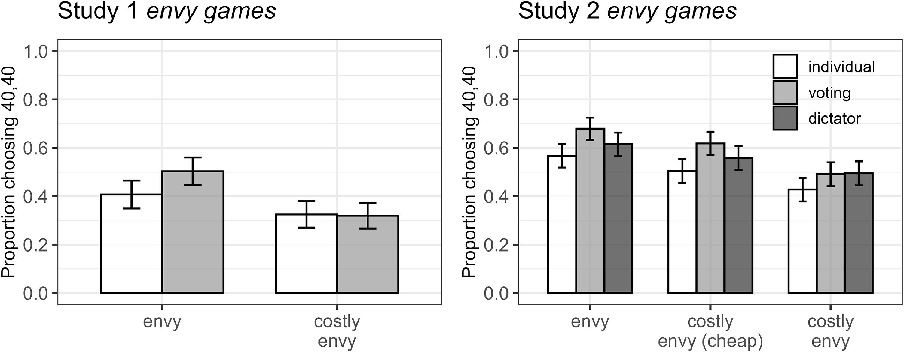

## Citation

Hansson, K., Barrafrem, K., Mayiwar, L., Persson, E., & Tinghög, G. (2026). Envy in the ballot box: How voting influences distributive preferences. *European Economic Review*, 105389. https://doi.org/10.1016/j.euroecorev.2026.105389

## Abstract

Voting is a cornerstone of democratic decision-making, but it may also diffuse individual responsibility, potentially encouraging people to support actions they would avoid when deciding alone. Such diffusion of responsibility could lead voters to prioritize relative standing over collective welfare, for example by endorsing policies that reduce others' advantages even at a cost to overall efficiency. Across two behavioral experiments (total N = 1,750), including a preregistered replication, we examined whether voting contributes to envy-driven behavior in distributive decisions. Participants made choices in redistribution games under three decision-making rules: individually, through majority voting, or, in Study 2, via a Random Dictator mechanism that involved group decision-making without majority rule. In both studies, voting contributed to a higher rate of envy-driven choices, in which participants sacrificed efficiency to reduce disadvantageous inequality. This effect replicated with nearly identical magnitude in the preregistered study and was strongest when the personal cost of acting enviously was low. Results from the Random Dictator condition indicated that group decision-making alone increased envy-driven behavior, consistent with diffusion of responsibility, while majority rule amplified this effect further. These findings suggest that collective decision-making can shift social preferences by diffusing personal responsibility, thereby fostering competitive motives rather than cooperative ones. This psychological mechanism helps explain why democratic decisions about redistribution may sometimes reflect relative concerns rather than collective welfare.

## Keywords

Voting; Diffusion of responsibility; Distribution; Equality; Envy; Experiment

