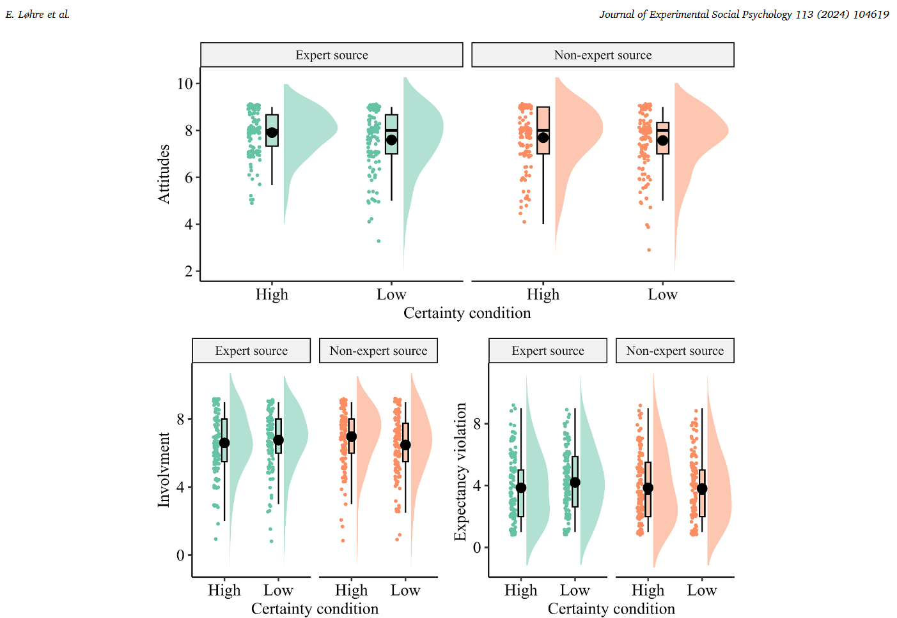

---
title: "Uncertainty, expertise, and persuasion: A replication and extension of Karmarkar and Tormala (2010)"
subtitle: "ournal of Experimental Social Psychology"
date: 2024-03-04
author: Løhre, E., S. P. Chandrashekar., Mayiwar, L., & Hærem, T.
draft: false
tags:
  - hugo-site
layout: single
links:
  - icon: osf
    icon_pack: ai
    name: OSF
    url: https://osf.io/hbjyv/
  - icon: doi
    icon_pack: ai
    name: Publication
    url: https://doi.org/10.1016/j.jesp.2024.104619
  - icon: file-pdf
    icon_pack: fa
    name: PDF
    url: pdf/JESP2024.pdf
---

## Abstract

If you are trying to persuade someone, expressing your opinion with certainty intuitively seems like a good strategy to maximize your influence. However, Karmarkar and Tormala (2010) found that the effectiveness of this tactic depends on expertise. In three experiments, Karmarkar and Tormala found support for an incongruity hypothesis, whereby non-expert sources can gain interest and influence by expressing certainty, while expert sources can increase persuasion by expressing uncertainty. In this Registered Report, we conducted a high-powered (N = 1018) direct replication of Experiment 2 by Karmarkar and Tormala (2010). In a consumer behaviour context, the original study examined whether source expertise moderated the positive effect of source certainty on the persuasive impact of a restaurant recommendation. The present replication failed to find support for the incongruity hypothesis, ηp2 = 0.00 [0.00, 0.02]: expressing certainty had a positive but non-significant effect for non-experts, d = 0.10 [−0.10, 0.34], and a positive effect for experts, d = 0.28 [0.03, 0.52]. Instead, the results supported the competing confidence heuristic hypothesis that expressed certainty would have a positive effect on persuasion, irrespective of source expertise, d = 0.18 [0.01, 0.36]. Extending the original work, we (1) controlled for the reason given for (un)certainty, and (2) examined need for closure as a potential individual difference moderator. The results indicated robust support for the confidence heuristic d = 0.25, [0.12, 0.37], but neither reason for (un)certainty nor need for closure moderated the effect as hypothesized. All materials, data, and code are available on: https://osf.io/hbjyv/.

