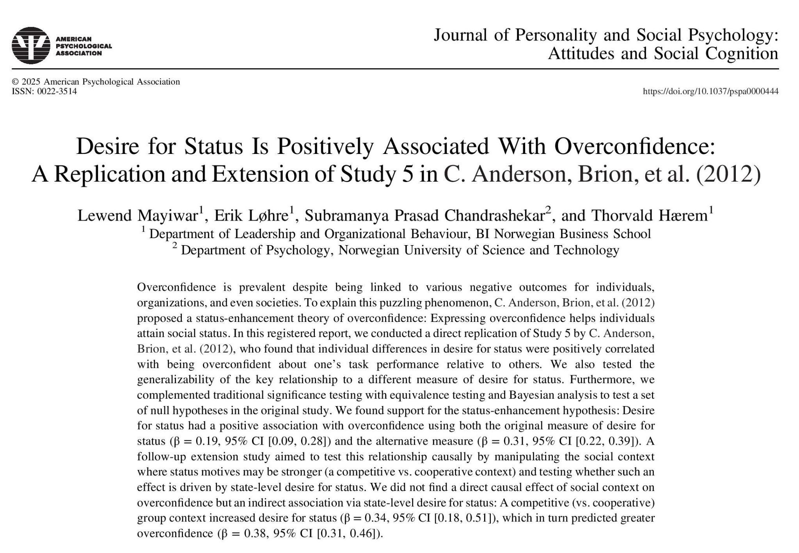

## Abstract

Overconfidence is prevalent despite being linked to various negative outcomes for individuals, organizations, and even societies. To explain this puzzling phenomenon, C. Anderson, Brion, et al. (2012) proposed a status-enhancement theory of overconfidence: Expressing overconfidence helps individuals attain social status. In this registered report, we conducted a direct replication of Study 5 by C. Anderson, Brion, et al. (2012), who found that individual differences in desire for status were positively correlated with being overconfident about one’s task performance relative to others. We also tested the generalizability of the key relationship to a different measure of desire for status. Furthermore, we complemented traditional significance testing with equivalence testing and Bayesian analysis to test a set of null hypotheses in the original study. We found support for the status-enhancement hypothesis: Desire for status had a positive association with overconfidence using both the original measure of desire for status (β = 0.19, 95% CI [0.09, 0.28]) and the alternative measure (β = 0.31, 95% CI [0.22, 0.39]). A follow-up extension study aimed to test this relationship causally by manipulating the social context where status motives may be stronger (a competitive vs. cooperative context) and testing whether such an effect is driven by state-level desire for status. We did not find a direct causal effect of social context on overconfidence but an indirect association via state-level desire for status: A competitive (vs. cooperative) group context increased desire for status (β = 0.34, 95% CI [0.18, 0.51]), which in turn predicted greater overconfidence (β = 0.38, 95% CI [0.31, 0.46]). (PsycInfo Database Record (c) 2025 APA, all rights reserved)

