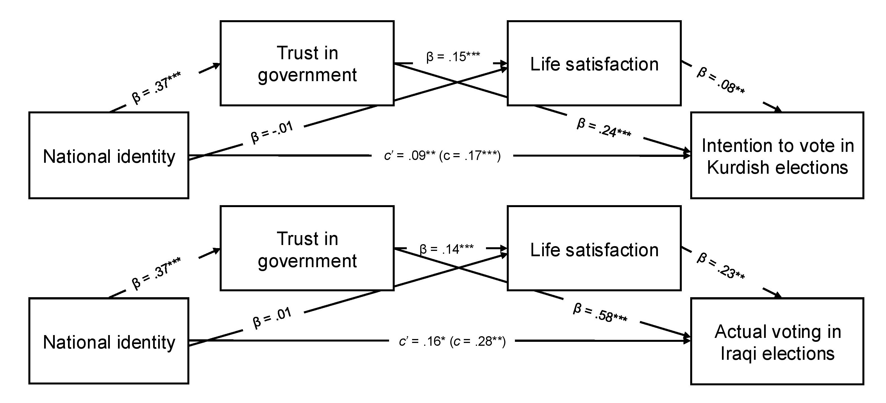

## Abstract

Voting is a pillar of democracy, yet its psychological correlates remain understudied outside the West. We examine how national identity predicts voting among Kurds in the Kurdistan Region of Iraq (KRI), a politically autonomous yet stateless region with a long history of ethnic persecution and struggles for recognition. Voter turnout has remained high in regional Kurdish elections but has dropped to a historical low in Iraqi parliamentary elections, reflecting public disillusionment. Using a large, representative sample (N = 1,072), we found that national identity predicted both intended voting in the then-upcoming Kurdish elections and actual participation in the 2021 Iraqi elections. These associations also occurred indirectly via trust in government and life satisfaction, and held after controlling for various psychological and sociodemographic variables. These findings suggest that a strong national identity may help sustain civic engagement even amid ongoing political and economic instability, and uncertainty over the region’s future.

