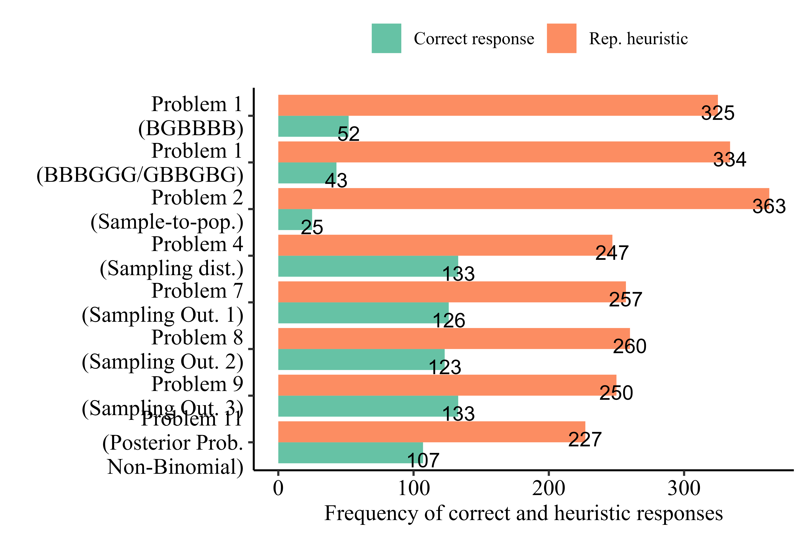

## Abstract

Kahneman and Tversky (1972) showed that when people make probability judgments, they tend to ignore relevant statistical information (e.g., sample size) and instead rely on a representativeness heuristic, whereby subjective probabilities are influenced by the degree to which a target is perceived as similar to (representative of) a typical example of the relevant population, class or category. Their paper has become a cornerstone in many lines of research and has been used to account for various biases in judgment and decision-making. Despite the impact this article has had on theory and practice, there have been no direct replications. In a preregistered experiment (N = 623; Amazon MTurk on CloudResearch), we conducted a replication and extensions of nine problems from Kahneman and Tversky (1972). We successfully replicated eight out of the nine problems. We extended the replication by examining the consistency of heuristic responses across problems and by examining decision style as predictor of participants’ use of the representativeness heuristic. Materials, data, and code are available on https://osf.io/nhqc4/.

