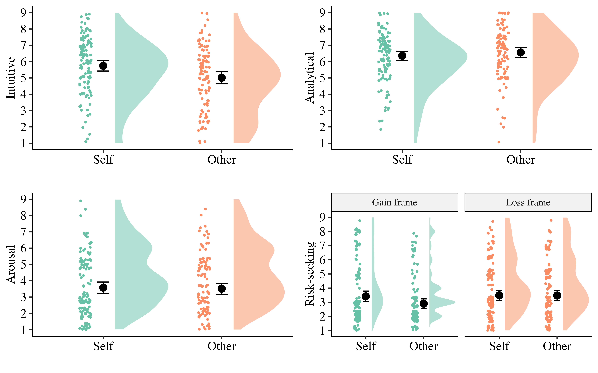

## Abstract

A substantial body of research has shown that risky decisions made for others often differ from those made for oneself. However, findings remain mixed, and there is still ongoing discussion about when and for whom self-other differences are most likely to emerge or be strongest. Building on previous research, which has primarily focused on lay samples and the outcomes of decision-making rather than the underlying processes, the current study reports on four preregistered experiments examining self–other differences across various professional domains, while also testing the commonly assumed cognitive mechanisms. Participants (total N = 1,337) were financial advisors at a large trade union (Experiment 1), leaders at a local government organization (Experiment 2) and a large hospital (Experiment 3), and a general sample of employees and leaders (Experiment 4). Participants completed a risky choice problem tailored to reflect their professional background (Experiments 1–3), where they were asked to choose between a safe and risky option either for themselves or for a hypothetical other, in both gain and loss frames. They then reported the extent to which they engaged in intuitive and analytical processing, and their emotional arousal. There was no evidence for consistent self-other differences in risk and no moderation by frame. In addition, there were no self-other differences in cognitive processing or affect. However, there was a main effect of framing in all experiments—that is, greater risk-seeking in loss (vs. gain) frames.

