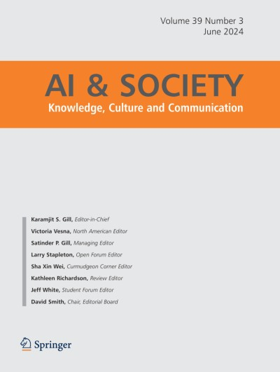

## Abstract

How can people lead fulfilling lives both thanks to and despite the constant use of digital media and artificial intelligence? While the prevailing narrative often portrays these technologies as generally harmful to well-being, the reality is of course more nuanced—some individuals benefit, while others do not. Existing research has predominantly focused on the general consequences of digital media on well-being, with less attention given to the individual-level antecedents of digital well-being. In the present study, we aimed to identify the traits and characteristics of individuals who use digital tools in ways that promote their well-being. Using a large representative sample from Sweden (N = 1999), we explore how digital self-control, digital literacy (objective and subjective), and digital information ignorance predict digital well-being, life satisfaction, and social anxiety. Digital self-control and subjective digital literacy positively predicted digital well-being. Digital self-control also predicted greater life satisfaction. Finally, digital information ignorance predicted increased life satisfaction and social anxiety. Overall, the current study contributes to a growing literature on digital well-being by exploring its antecedents.

