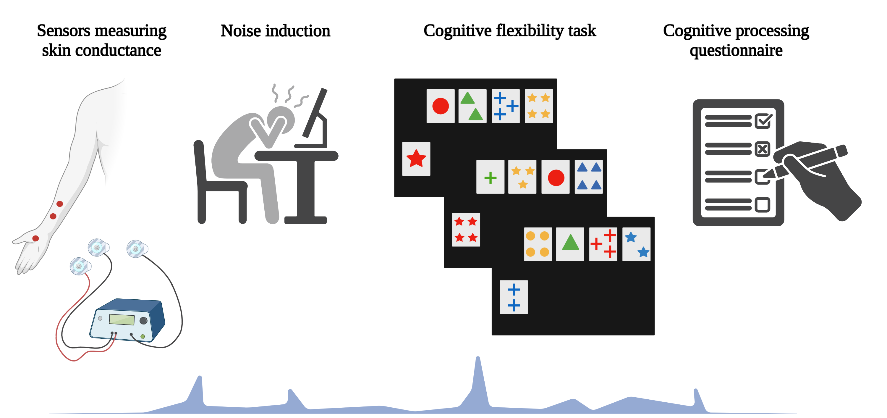

## Abstract

We draw on arousal-based models to develop and test a model of open-office noise and information processing. Specifically, we examined whether open-office noise changes how people process information and whether such a change has consequences for task performance. In a laboratory experiment, we randomly assigned participants (107 students at a business school) to either a silent condition or a condition that exposed them to open-office noise (irrelevant speech) while completing a task that requires cognitive flexibility. We measured participants’ physiological arousal and the extent to which they processed information intuitively and analytically during the task. Open-office noise increased urgent processing and decreased analytical processing, which led to a respective decrease and increase in task performance. In line with a neuroscientific account of cognitive processing, an increase in arousal (subjective and physiological) drove the detrimental effect of open-office noise on task performance. Understanding the information-processing consequences of open-office noise can help managers make more informed decisions about workplace environments that facilitate performance. Our study is one of the first to examine the indirect effects of open-office noise on task performance through intuitive and analytical processing, while simultaneously testing and providing support for the accompanying physiological mechanism.

