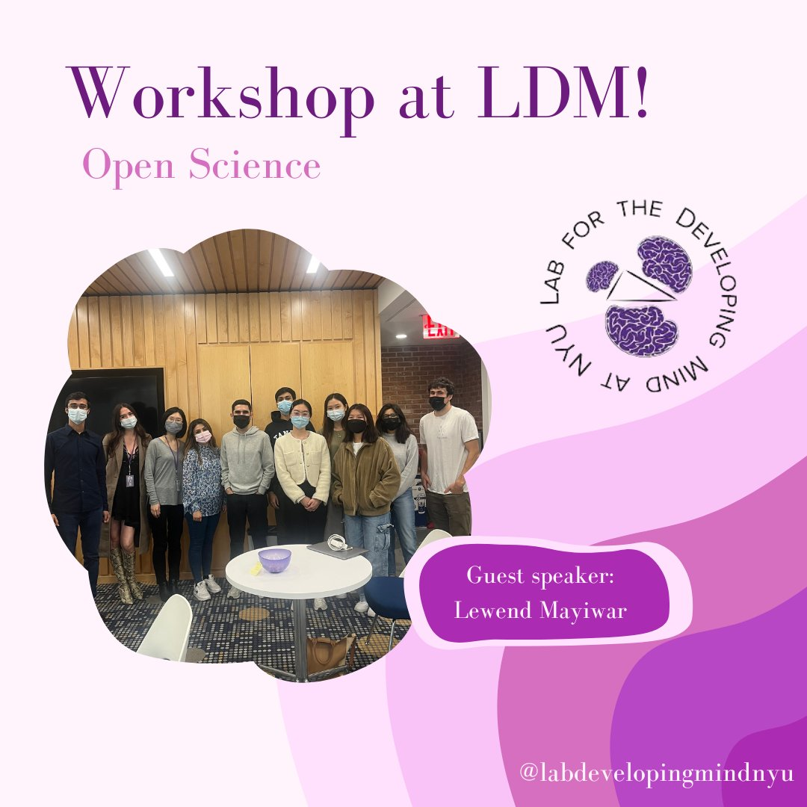

Invited for a talk on the challenges and benefits of practicing open science as a junior researcher for the Lab for the Developing Mind at New York University.

👉 Access my slides [here](https://osf.io/wmrz5).
