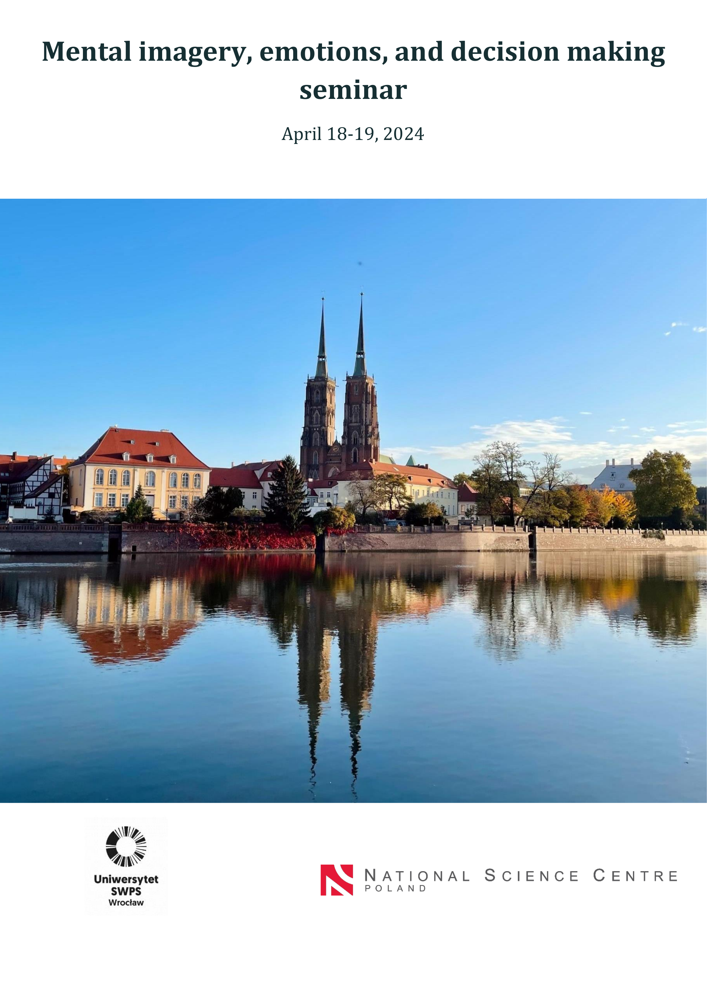

Invited for a talk at research seminar with a small group of experts in mental imagery, emotions, and decision-making. I presented an ongoing post-doc project (together with Emil Persson, Gustav Tinghög, Daniel Västfjäll, at JEDI Lab, Linköping University) where we examine the role of psychological distance and mental imagery in decisions involving trust.

