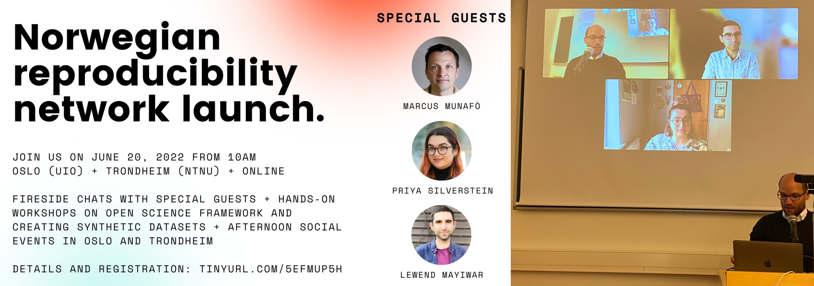

I was invited to participate in a panel discussion together with Dr. Priya Silverstein for the Norwegian Reproducibility Network's Kick-Off Event. We discussed the challenges and benefits of practicing open science for early career researchers. Priya is a researcher who does amazing work in open science and it was such an honor and pleasure to chat with her. The discussion was moderated by Dr. Julien Mayor (University of Oslo). Our discussion followed an excellent keynote talk by Dr. Marcus Munafo.