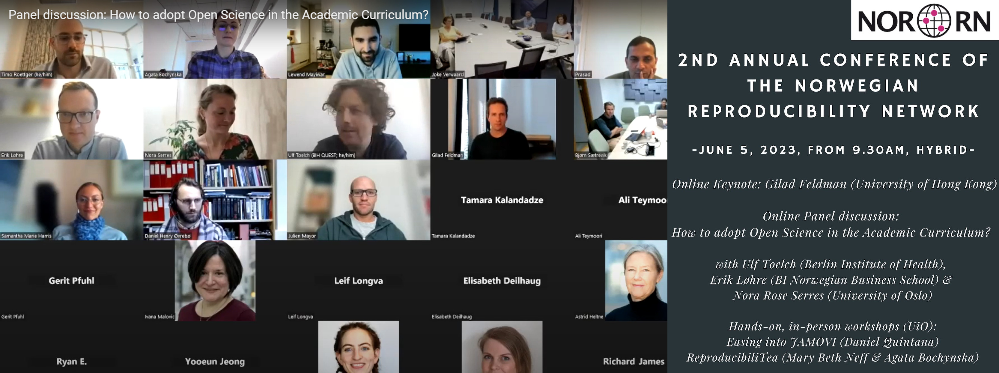

I had the pleasure of moderating a panel discussion on open science in higher education at the Norwegian Reproducibility Network's Annual Conference. The panelists were Ulf Toelch (QUEST Center for Responsible Research, Berlin Institute of Health), Nora Rose Serres (PhD Candidate), and Erik Løhre (Associate Professor in Organizational Behavior, BI Norwegian Business School). The panelists were invited to discuss how universities and business schools can integrate practices like reproducibility, replications, and registered reports in higher education.

👉 Recording can be accessed [here](https://www.youtube.com/watch?v=q0Rs3BMw4UA&t=2s).