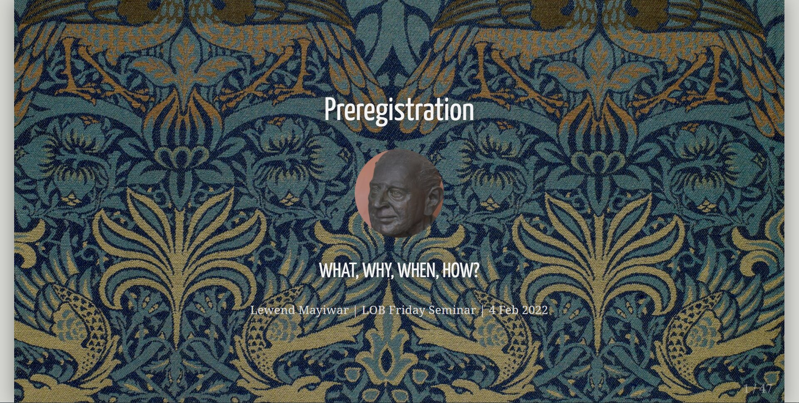

I gave a talk on preregistration for the department of Leadership & Organizational Behavior at BI Norwegian Business School. This was an introduction to preregistration, where I covered what a preregistration is, why we do it, when we should and *shouldn't* do it, and how to preregister studies on the Open Science Framework (OSF).

👉 You can access my slides [here](https://osf.io/x69ed/).
