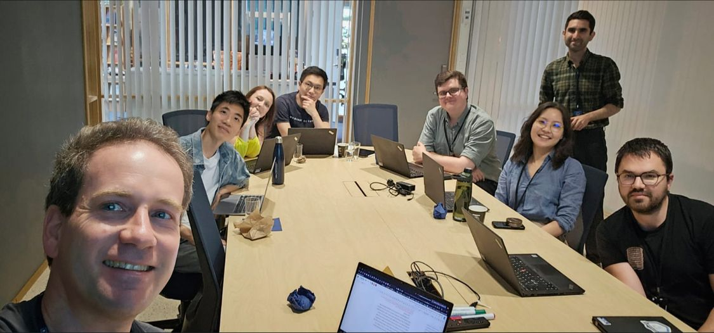

I was so excited to invite Gilad Feldman, Assistant Professor at Hong Kong University, for a hands-on workshop on replications at our department. For two intensive days, Gilad walked us through every key stage of conducting a replication. We targeted a classic study to replicate, dissected the target to figure out how to replicate it, preregistered analytical plan and hypotheses, collected data, and even ended up with a manuscript draft that we worked on together. Researchers from three different departments participated in the workshop. Gilad also delivered a fascinating talk at BI Norwegian Business School on how researchers can tackle challenges in science and society through the power of collaboration and team science. 

👉 Materials from our workshop can be accessed [here](https://osf.io/a2tgb/).

👉 Recording of the talk is available [here](https://www.youtube.com/watch?v=HOY35Br6Dfc).